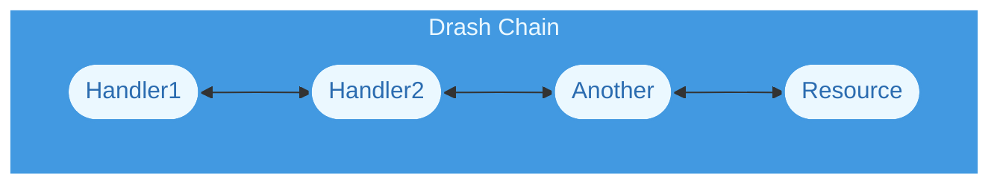

# Chains

## What Is a Chain?

In the context of Drash, a chain is a set of handlers connected together to form a variant of the [Chain of Responsibility](https://en.wikipedia.org/wiki/Chain-of-responsibility_pattern) pattern. Each handler receives an __input__ and returns an __output__. Chains are responsible for:

- connecting handlers together;
- receiving inputs from clients;
- sending inputs to handlers; and
- returning outputs from handlers to clients.

In simplest form, their flow looks like:

When you build HTTP applications with Drash you do not assemble a chain yourself &mdash; you
use the HTTP module's [`Application`](/about/concepts/http-application) class, which
assembles one for you. This page covers what a chain is; that page covers the one you
actually build.

## What Data Does a Chain Process?

Chains process the data you give them. You are in charge of defining what goes into a
chain and what comes out. Handlers pass along the input you give them, not a fixed
request type &mdash; which is why one chain can take a Web `Request` on one runtime and a plain
context object on another, and both work.

What a *particular* chain requires of that data is up to the handlers it holds. For the
HTTP module's `Application`, see
[the data it requires](/about/concepts/http-application#handler-requirements).

## Building a Chain of Your Own

The HTTP module's `Application` is the only chain Drash ships that serves a purpose out of
the box. To compose a different one, extend
[`AbstractChainBuilder`](/reference/standard/chains/abstract-chain-builder) or use
[`BaseChain`](/reference/standard/chains/abstract-chain-builder), which takes whatever
handlers you give it in the order you give them.
