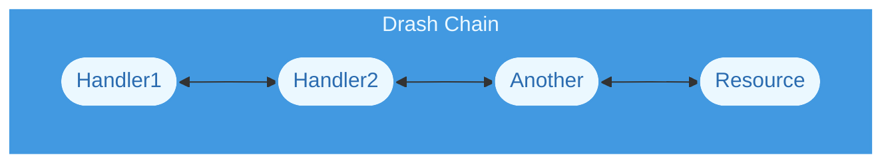

# Chains

## What Is a Chain?

In the context of Drash, a chain is a set of handlers connected together to form a variant of the [Chain of Responsibility](https://en.wikipedia.org/wiki/Chain-of-responsibility_pattern) pattern. Each handler receives an **input** and returns an **output**. Chains are responsible for:

- connecting handlers together;
- receiving inputs from clients;
- sending inputs to handlers; and
- returning outputs from handlers to clients.

In simplest form, their flow looks like:



When you build HTTP applications with Drash, you use the HTTP module's [`Application`](/reference/modules/http-native) class. Under the hood it assembles an HTTP request chain that processes HTTP requests (more on this below — [What the HTTP Module's Application Assembles](#what-the-http-modules-application-assembles)). From there, you give it [resources](/docs/concepts/resources) to process those requests and respond to them.

{/* ## Where Is the Chain Placed?

**The chain is placed by you, behind your chosen runtime's HTTP server.**

A chain on its own does nothing. It needs a runtime to receive HTTP requests, and it needs to be connected to that runtime's HTTP server. Once the server is running and clients are making requests — and once your resources talk to whatever services hold your data — the full picture looks like:

```mermaid
flowchart LR
    browser([Browser])
    runtimes([HTTP Server])
    h1([Handler1])
    h2([Handler2])
    h3([Another])
    h4([Resource])

    subgraph lifecycle[ ]
      direction LR
      subgraph client[Client]
        browser
      end
      subgraph runtime[Runtime]
        browser <--> runtimes
      end
      subgraph chain[Drash Chain]
        direction LR
        runtimes <--> h1 <--> h2 <--> h3 <--> h4
      end
      subgraph external[Some Service]
        h4 <--> apiEndpoint([API Endpoint])
      end
    end

    style lifecycle fill:#ffffff,color:#ffffff;
    style external fill:#ffffff,stroke:#ffffff,color:#4299e1;
    style client fill:#fc8181,stroke:#fc8181,stroke-width:2px,color:#fff5f5;
    style runtime fill:#38b2ac,stroke:#38b2ac,stroke-width:2px,color:#e6fffa;
    style chain fill:#4299e1,stroke:#4299e1,stroke-width:2px,color:#ebf8ff;

    classDef red fill:#fff5f5,stroke:#fc8181,stroke-width:2px,color:#c53030;
    classDef green fill:#e6fffa,stroke:#38b2ac,stroke-width:2px,color:#234e52;
    classDef blue fill:#ebf8ff,stroke:#4299e1,stroke-width:2px,color:#2b6cb0;
    classDef ext fill:#ebf8ff,stroke:#4299e1,stroke-width:2px,color:#2b6cb0;

    class browser red
    class runtimes green
    class h1,h2,h3,h4 blue
    class apiEndpoint ext
```



Clients could make requests to the API Endpoint _through_ the runtime's HTTP server and Drash's chain. */}

## What the HTTP Module's Application Assembles

The HTTP module's `Application` assembles the following handlers in this order:

| # | Handler                   | What it does                                                           |
| - | ------------------------- | ---------------------------------------------------------------------- |
| 1 | `RequestValidator`        | Rejects inputs lacking a readable `url` or `method` field.                     |
| 2 | `ResourcesIndex`          | Matches `input.url` against each resource's `paths` using `URLPattern` or a polyfilled `URLPattern`. |
| 3 | `ResourceNotFoundHandler` | Throws `HTTPError(404)` when the `ResourcesIndex` handler cannot find a matching resource.                 |
| 4 | `RequestParamsParser`     | Defines a non-enumerable `params` property on the request. Access it via `request.params`.              |
| 5 | `ResourceCaller`          | Invokes `resource[METHOD](request)` (e.g., `UsersResource.GET(request)`).                                    |

The order is not configurable through the builder. What you control is the set of resources or resource groups you provide. For example:

```ts
const app = Application
  .builder()            // Assembles all handlers above
  .resources(/* ... */) // Your resources come after so they can be called by `ResourceCaller`
  .build()              // Builds the chain in the above order
```

## What Data Does a Chain Process?

Chains process the data you give them. You are in charge of defining what goes into it and what comes out. This is true for the HTTP module's `Application` class. Its handlers pass along the input you give them, not a fixed request type. That is why Node can hand it a plain context object while Deno hands it a Web `Request`, and both work.

### Requirements

The only requirements are:

1. The data must be a single object.
1. The object must have a `url: string` property, and it must be a _fully qualified URL_:

   ```ts
   // Good
   const url: string = "http://localhost:1447/accounts/1337";

   // Bad
   const url: string = "/accounts/1337";
   ```

1. The object must have a `method: string` property that is a valid [HTTP request method](https://developer.mozilla.org/en-US/docs/Web/HTTP/Methods):

   ```ts
   // Uppercase is OK
   const method: string = "GET";

   // Lowercase is also OK
   const method: string = "get";
   ```

Given the above, the single data object could look like:

```ts
const input = {
  url: "http://localhost:1447/accounts/1337",
  method: "get",
  //
  // ... other fields
  //
}
```

The `RequestValidator` handler the above shape and throws `HTTPError(422)` with one of the following error messages if that shape is not met:

- Request could not be read
- Request HTTP method could not be read
- Request URL could not be read

### Examples of Correct Data

The minimum:

```ts
const minimal = {
  url: "http://localhost:1447/accounts/1337",
  method: "get",
};
```

In Node, you might find yourself using something like:

```js
const context = {
  url: "http://localhost:1447/accounts/1337",
  method: "get",
  request, // IncomingMessage
  response, // ServerResponse
  // ... add as many fields as you wish
};
```

## Errors Propagate to You

`chain.handle()` returns a `Promise`. Errors thrown anywhere in the chain — including a resource method — reject that promise. Drash writes nothing to the socket, so **your `.catch()` is the only thing standing between an error and the client**.

```ts
chain
  .handle<Response>(request)
  .catch((error) => {
    // You decide what the client sees.
  });
```

This is deliberate: translating an error into a response is runtime-specific, and Drash does not own your response object. See [HTTPError](/reference/core/errors/http-error).

## Path Matching

The `ResourcesIndex` handler appends `{/}?` to every path before compiling it, so `/users` matches `/users/` too. Match results are cached by fully-qualified URL.

Because matching is `URLPattern`-based, path parameters use `URLPattern` syntax:

```ts
class Users extends Resource {
  paths = ["/users/:id?"];
}
```

You can access request params via [`request.params`](/docs/requests/handling-requests).

See [Resources > Creating a Resource > Dynamic Paths](/docs/resources/creating-a-resource#dynamic-paths) for the full syntax.

## Next Steps

- Read about [how resources play a role in the chain](/docs/concepts/resources).
- [Create a tiny HTTP application](/docs/getting-started/step-by-step-guide).
