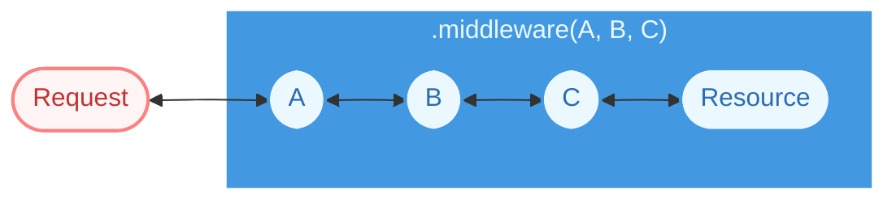

# Middleware

`Middleware` **extends `Resource`**. It is a [decorator](https://refactoring.guru/design-patterns/decorator), not a separate concept — which is why it has the same HTTP method surface and why it can stand in for the resource it wraps.

<Callout type="info">
  In [v2.x](https://drash.land/drash/v2.x/tutorials/services/basics) these were
  called "services". From v3 onward they are "middleware", matching [MDN's
  definition](https://developer.mozilla.org/en-US/docs/Glossary/Middleware).
</Callout>

## Ordering

`.middleware(A, B, C)` nests outermost-first — each middleware wraps the next, and the
innermost one wraps your resource:



A request travels inward — `A`, then `B`, then `C` — before it reaches your resource. The
response travels back out the same way, so anything a middleware does *after* its
`this.next()` call runs in the reverse order: `C`, then `B`, then `A`.

## Per-Resource Instances

Middleware instances are constructed **fresh per resource**. Two resources sharing a middleware class do not share an instance.

<Callout type="warning">
Do not introduce shared or singleton middleware state across resources — and do not keep per-request state on `this`, since one instance serves concurrent requests for its resource.
</Callout>

## Applying Middleware

You apply middleware by [grouping resources](/docs/resources/grouping-resources).

```ts
const group = ResourceGroup
  .builder()
  .middleware(Auth)
  .resources(Users)
  .build();

const app = Application.builder().resources(...group).build();
```

## Pre-Built Middleware

Drash ships with the following pre-built middleware modules. Each is documented in the [Reference](/reference) pages with its options, defaults,
and exports:

| Middleware                                                         | What it does                                                        |
| ------------------------------------------------------------------ | ------------------------------------------------------------------- |
| [AcceptHeader](/reference/modules/middleware/accept-header)         | Rejects requests whose `Accept` header the resource cannot satisfy   |
| [CORS](/reference/modules/middleware/cors)                          | Answers preflight `OPTIONS` requests and sets CORS response headers  |
| [ETag](/reference/modules/middleware/etag)                          | Adds `ETag` headers and answers `304 Not Modified` on a match        |
| [RateLimiter](/reference/modules/middleware/rate-limiter)           | Limits requests per client and sets the `X-RateLimit-*` headers      |

Each pre-built middleware module is a class you pass to `.middleware()`. For example:

<Tabs items={["Deno", "Node", "Bun", "Cloudflare Workers"]}>

<Tabs.Tab>

```ts
import { ResourceGroup } from "npm:@drashland/drash/modules/http.native.js";
import { AcceptHeader } from "npm:@drashland/drash/modules/middleware/AcceptHeader.js";
import { CORS } from "npm:@drashland/drash/modules/middleware/CORS.js";
import { ETag } from "npm:@drashland/drash/modules/middleware/ETag.js";
import { RateLimiter } from "npm:@drashland/drash/modules/middleware/RateLimiter.js";
 
const group = ResourceGroup
  .builder()
  .middleware(
    AcceptHeader(),
    CORS(),
    ETag(),
    RateLimiter(),
  )
  .resources(/* shortened for brevity */)
  .build();
```

</Tabs.Tab>

<Tabs.Tab>

```ts
import { ResourceGroup } from "@drashland/drash/modules/http.polyfill.js";
import { AcceptHeader } from "@drashland/drash/modules/middleware/AcceptHeader.js";
import { CORS } from "@drashland/drash/modules/middleware/CORS.js";
import { ETag } from "@drashland/drash/modules/middleware/ETag.js";
import { RateLimiter } from "@drashland/drash/modules/middleware/RateLimiter.js";
 
const group = ResourceGroup
  .builder()
  .middleware(
    AcceptHeader(),
    CORS(),
    ETag(),
    RateLimiter(),
  )
  .resources(/* shortened for brevity */)
  .build();
```

</Tabs.Tab>

<Tabs.Tab>

```ts
import { ResourceGroup } from "@drashland/drash/modules/http.polyfill.js";
import { AcceptHeader } from "@drashland/drash/modules/middleware/AcceptHeader.js";
import { CORS } from "@drashland/drash/modules/middleware/CORS.js";
import { ETag } from "@drashland/drash/modules/middleware/ETag.js";
import { RateLimiter } from "@drashland/drash/modules/middleware/RateLimiter.js";
 
const group = ResourceGroup
  .builder()
  .middleware(
    AcceptHeader(),
    CORS(),
    ETag(),
    RateLimiter(),
  )
  .resources(/* shortened for brevity */)
  .build();
```

</Tabs.Tab>

<Tabs.Tab>

```ts
import { ResourceGroup } from "@drashland/drash/modules/http.native.js";
import { AcceptHeader } from "@drashland/drash/modules/middleware/AcceptHeader.js";
import { CORS } from "@drashland/drash/modules/middleware/CORS.js";
import { ETag } from "@drashland/drash/modules/middleware/ETag.js";
import { RateLimiter } from "@drashland/drash/modules/middleware/RateLimiter.js";
 
const group = ResourceGroup
  .builder()
  .middleware(
    AcceptHeader(),
    CORS(),
    ETag(),
    RateLimiter(),
  )
  .resources(/* shortened for brevity */)
  .build();
```

</Tabs.Tab>

</Tabs>

## Next Steps

- [Create your own middleware](/docs/middleware/creating-middleware).
- [Group resources](/docs/resources/grouping-resources) to apply it.
