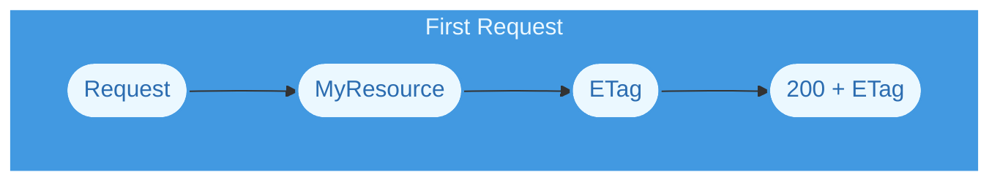

# ETag

<Callout type="info" emoji={null}>
An ETag lets a client ask "has this changed?" and get an empty answer when it
has not. The saving is bandwidth, not work &mdash; your resource still runs to
produce the response the ETag is calculated from.
</Callout>

## Summary

The ETag middleware adds `ETag` and `Last-Modified` headers to responses, and
answers `304 Not Modified` when a client's `If-None-Match` matches. It is added
to resources using a [resource group](/reference/standard/resource-group).

The highlighted section below shows how it is added:

<Tabs items={["Deno v1.46.x"]}>

<Tabs.Tab>

```typescript showLineNumbers  {8}
// Code is shortened for brevity

import { ResourceGroup } from "@drashland/drash/modules/http.native.js";
import { ETag } from "@drashland/drash/modules/middleware/ETag/mod.js";

const group = ResourceGroup
  .builder()
  .middleware(ETag())         // Calling it with no options uses the defaults
  .resources(Users)
  .build();
```

</Tabs.Tab>
</Tabs>

Like the other bundled middleware, `ETag` is a __factory__. Calling it returns a
middleware class with your options already bound to it.

## Configuring Options

### The Defaults

| Option            | Type      | Default | Notes                                                               |
| ----------------- | --------- | ------- | ------------------------------------------------------------------- |
| `etag_max_length` | `number`  | `27`    | Characters of the body to encode &mdash; __currently ignored__      |
| `weak`            | `boolean` | `false` | Emit a weak validator (`W/"..."`)                                   |

Options you leave out keep their defaults, so a partial object is safe.

### Emitting Weak Validators

A weak ETag (`W/"abc"`) tells caches two representations are semantically
equivalent even when the bytes differ. Set it when byte-for-byte equality is not
what you want compared:

```typescript showLineNumbers
// Responses that differ only in, say, a timestamp will still be treated as
// unchanged by caches.
ETag({
  weak: true,
});
```

### About `etag_max_length`

<Callout type="warning" emoji={null}>
__This option currently has no effect.__ The middleware declares it as
`etag_max_length`, but the code that builds the value
(`ETagResponse.etagHeader()`) reads `max_hash_length` &mdash; a different
property. What you pass is therefore `undefined` where it is used, and the
internal default of `27` applies regardless. Both defaults are `27`, which is
why the mismatch is easy to miss.
</Callout>

```typescript showLineNumbers
// Accepted, but ignored. The value is still cut at 27.
ETag({
  etag_max_length: 64,
});
```

The number is not a hash length either. The value is built by truncating the
response body to that many characters, base64-encoding the result, and prefixing
it with the body's full length in hex:

```text
"a-T2ggc28gZWFzeQ=="
 │  └── base64 of the first 27 characters of the body
 └───── full body length, in hex (10 characters)
```

## How It Works

### TLDR

Your resource runs and produces a response. The middleware calculates an ETag
from that response's body. If the client already has that exact ETag, the body
is thrown away and a `304` is sent instead.

### Detailed Explanation

The middleware runs after your resource, because it needs the response body to
calculate anything. What happens next depends on the request:

| Request                                  | Result                                    |
| ---------------------------------------- | ----------------------------------------- |
| No `If-None-Match`                       | Response gains `ETag` and `Last-Modified` |
| `If-None-Match` matches the current ETag | `304 Not Modified`, empty body            |
| `If-None-Match` does not match           | Full response with a fresh `ETag`         |

An empty response body still gets an ETag. The encoding of empty content is
stable, so repeat requests for an empty resource still revalidate correctly.

### Data Flow

<div className="tutorials:chains:introduction flowchart-drash-chain">

</div>

<div className="tutorials:chains:introduction flowchart-drash-chain">

</div>

As you can see above, your resource is called in __both__ flows. The `304` saves
sending the body, not producing it.

## Extending This Middleware

The module exports the class as well as the factory, so you can extend it:

```typescript showLineNumbers
import { ETagMiddleware } from "@drashland/drash/modules/middleware/ETag/mod.js";

class LoggedETag extends ETagMiddleware {
  constructor() {
    // Your options go here, the same ones you would pass to ETag().
    super({ weak: true });
  }

  public override ALL(request: Request) {
    console.log(`If-None-Match: ${request.headers.get("if-none-match")}`);

    // Hand it back to the original middleware and get out of the way.
    return super.ALL(request);
  }
}
```

| Export           | What It Is                                         |
| ---------------- | -------------------------------------------------- |
| `ETag`           | The factory. Returns a configured middleware class |
| `ETagMiddleware` | The middleware class itself, for extending         |
| `defaultOptions` | The defaults listed above                          |
| `Options`        | The options type                                   |
