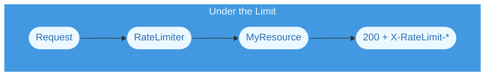

# RateLimiter

<Callout type="info" emoji={null}>
Clients are identified by a header they send themselves. Unless that header is
one you issue and verify, treat this as request shaping for cooperative clients
&mdash; not as an abuse control.
</Callout>

## Summary

The RateLimiter middleware counts requests per client within a rolling time
window and rejects the ones over the limit. It is added to resources using a
[resource group](/reference/standard/resource-group).

The highlighted section below shows how it is added:

<Tabs items={["Deno v1.46.x"]}>

<Tabs.Tab>

```typescript showLineNumbers  {8-11}
// Code is shortened for brevity

import { Resource } from "@drashland/drash/modules/http.native.js";
import { RateLimiter } from "@drashland/drash/modules/middleware/RateLimiter.js";

const group = Resource
  .group()
  .middleware(RateLimiter({
    max_requests: 100,                  // 100 requests ...
    rate_limit_time_window_length: 60000, // ... per minute
    client_id_header_name: "x-api-key", // Counted against this header's value
  }))
  .resources(Users)
  .build();
```

</Tabs.Tab>
</Tabs>

Like the other bundled middleware, `RateLimiter` is a __factory__. Calling it
returns a middleware class with your options already bound to it.

## Configuring Options

### The Defaults

| Option                                    | Type      | Default                         | Notes                                 |
| ----------------------------------------- | --------- | ------------------------------- | ------------------------------------- |
| `max_requests`                            | `number`  | `3`                             | Requests allowed per window           |
| `rate_limit_time_window_length`           | `number`  | `60000`                         | Window length in milliseconds         |
| `client_id_header_name`                   | `string`  | `"x-drash-ratelimit-client-id"` | Request header identifying the client |
| `throw_if_connection_header_name_missing` | `boolean` | `true`                          | Throw when that header is absent      |

Options you leave out keep their defaults, so each example below sets only what
it is demonstrating.

### Tuning the Window

`max_requests` and `rate_limit_time_window_length` are read together, and the
second is in __milliseconds__:

```typescript showLineNumbers
// 100 requests per minute.
RateLimiter({ max_requests: 100, rate_limit_time_window_length: 60000 });

// 10 requests per second, for a burst-sensitive endpoint.
RateLimiter({ max_requests: 10, rate_limit_time_window_length: 1000 });

// The defaults: 3 requests per minute.
RateLimiter();
```

### Identifying Clients

`client_id_header_name` names the request header the limiter counts against. The
default is `x-drash-ratelimit-client-id`, which nothing sets for you &mdash;
point it at a header your clients or your proxy actually send:

```typescript showLineNumbers
// Behind a proxy that forwards the caller's address.
RateLimiter({
  client_id_header_name: "x-forwarded-for",
});
```

There is __no IP fallback__. A client is whatever that header says it is, so
anyone can present a fresh value and get a fresh budget.

### Handling a Missing Header

`throw_if_connection_header_name_missing` decides what happens when a request
arrives without that header. `true` rejects it with a `400`; `false` lets it
straight through, since there is no client to count:

```typescript showLineNumbers
// Fail open. A request with no identifying header is not counted at all.
RateLimiter({
  throw_if_connection_header_name_missing: false,
});
```

<Callout type="warning" emoji={null}>
Setting this to `false` makes the limit __trivially avoidable__ &mdash; omit the
header and you are never counted. Prefer `true` unless something upstream
guarantees the header is present.
</Callout>

## How It Works

### TLDR

The middleware reads the client's header, counts the request against that
client's budget, and either passes the request to your resource or throws a
`429`. Either way the response comes back tagged with `X-RateLimit-*` headers.

### Detailed Explanation

Unlike ETag, this middleware does its work __before__ your resource. A request
over the limit never reaches the resource at all, which is the point &mdash; the
work is what you are trying to avoid.

Exceeding the limit throws an `HTTPError` with status `429 Too Many Requests`.
Responses carry:

| Header                  | Meaning                             |
| ----------------------- | ----------------------------------- |
| `X-RateLimit-Limit`     | `max_requests`                      |
| `X-RateLimit-Remaining` | Requests left in the current window |
| `X-RateLimit-Reset`     | When the window resets              |
| `X-Retry-After`         | Sent with `429` responses           |

<Callout type="warning" emoji={null}>
The retry header is `X-Retry-After`, __not__ the standard `Retry-After`. Clients
and proxies that back off automatically on `Retry-After` will not see this one.
</Callout>

### State and Scope

Counters live __in memory, per middleware instance__. Because resource groups
construct middleware fresh per resource, two resources in the same group each
get their own independent counters rather than sharing one budget.

In-memory state also means limits are per process. Across several instances or
workers each keeps its own counts, so a shared store would be needed for a
global limit.

### Data Flow

<div className="tutorials:chains:introduction flowchart-drash-chain">

</div>

<div className="tutorials:chains:introduction flowchart-drash-chain">

</div>

As you can see above, a rejected request stops at the middleware and your
resource is never called.

## Extending This Middleware

The module exports the class as well as the factory, so you can extend it:

```typescript showLineNumbers
import { RateLimiterMiddleware } from "@drashland/drash/modules/middleware/RateLimiter.js";

class LoggedRateLimiter extends RateLimiterMiddleware {
  constructor() {
    // Your options go here, the same ones you would pass to RateLimiter().
    super({ max_requests: 100 });
  }

  public override ALL(request: Request) {
    console.log(`Client: ${request.headers.get("x-api-key")}`);

    // Hand it back to the original middleware and get out of the way.
    return super.ALL(request);
  }
}
```

| Export                  | What It Is                                         |
| ----------------------- | -------------------------------------------------- |
| `RateLimiter`           | The factory. Returns a configured middleware class |
| `RateLimiterMiddleware` | The middleware class itself, for extending         |
| `defaultOptions`        | The defaults listed above                          |
| `Options`               | The options type                                   |
