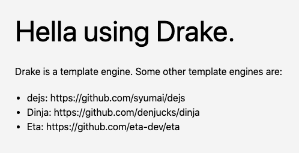

# Tengine

Tengine allows your Drash application to use a template engine.

## Table of Contents

* [Usage](#usage)
* [Configuration](#configuration)
* [Tutorial: Using Drake](#tutorial-using-drake)
    * [Folder Structure End State](#drake-folder-structure-end-state)
    * [Steps](#drake-steps)
    * [Verification](#drake-verification)
* [Tutorial: Using Eta](#tutorial-using-eta)
    * [Folder Structure End State](#eta-folder-structure-end-state)
    * [Steps](#eta-steps)
    * [Verification](#eta-verification)

## Usage

```typescript
// Import the Tengine middleware function
import { Tengine } from "https://deno.land/x/drash_middleware@v0.6.1/tengine/mod.ts";

// Use the default template engine that comes with Tengine, known as Drake.
// Returning false in the render method tells Tengine to use Drake. Specifying
// the views_path config tells Drake where your HTML files are located. The
// views_path config is required if Drake is being used.
const tengine = Tengine({
  render: (...args: unknown[]): boolean => {
    return false;
  },
  views_path: "./views"
});
```

## Configuration

### `render`

This config is required. Tengine uses this method to replace the `.render()` method in Drash's response object. The `...args` must always be of type `unknown[]` because you can use any template engine you want. You just have to specify that template engine's render method in this config so Tengine knows how to render templates.

```typescript
const tengine = Tengine({
  render: (...args: unknown[]): boolean => {
});
```

### `views_path`

This config is optional. If you're using the default template engine that comes with Tengine (known as Drake), then this config is required. Otherwise, leave this config out if you are using a different template engine. This config tells Drake where our HTML files are located. Note that this config value SHOULD NOT have a trailing slash.

```typescript
const tengine = Tengine({
  render: (...args: unknown[]): boolean => {
    return false;
  },
  views_path: "./views"
});
```

## Tutorial: Using Drake

This tutorial teaches you how to use Drake (Tengine's default template engine) to render HTML files in your Drash application.

### Drake: Folder Structure End State

```
▾ /path/to/your/project/
    ▾ views/
        index.html
        template_engines.html
    app.ts
    home_resource.ts
```

### Drake: Steps

1. Create your `app.ts` file.

    ```typescript
    import { Drash } from "https://deno.land/x/drash@v1.3.0/mod.ts";
    import { HomeResource } from "./home_resource.ts";
    import { Tengine } from "https://deno.land/x/drash_middleware@v0.6.1/tengine/mod.ts";

    const tengine = Tengine({
      render: (...args: unknown[]): boolean => {
        return false; // This render method returns false to tell Tengine to use Drake
      },
      views_path: "./views"
    });

    const server = new Drash.Http.Server({
      response_output: "text/html",
      resources: [
        HomeResource,
      ],
      middleware: {
        after_resource: [
          tengine
        ]
      },
    });

    server.run({
      hostname: "localhost",
      port: 1447,
    });

    console.log(`Server running at ${server.hostname}:${server.port}`);
    ```

2. Create your `home_resource.ts` file.

    ```typescript
    import { Drash } from "https://deno.land/x/drash@v1.3.0/mod.ts";

    export class HomeResource extends Drash.Http.Resource {

      static paths = ["/"];

      public GET() {
        // Call the .render() method and specify the first argument as a
        // relative path to the views_path config value. Notice, this
        // argument has a leading slash whereas the views_path config
        // does not have a trailing slash. Having a trailing slash in
        // the views_path config would make Drake look for ...
        //
        //     ./views_path//index.html
        //
        // ... which would cause an error.
        this.response.body = this.response.render(
          "/index.html",
          {
            message: "Hella using Drake.",
            template_engines: [
              {
                name: "dejs",
                url: "https://github.com/syumai/dejs",
              },
              {
                name: "Dinja",
                url: "https://github.com/denjucks/dinja",
              },
              {
                name: "Eta",
                url: "https://github.com/eta-dev/eta",
              }
            ],
          }
        );

        return this.response;
      }
    }
    ```

3. Create your `index.html` file.

    ```html
    <!DOCTYPE html>
    <html class="h-full w-full">
      <head>
        <meta charset="utf-8"/>
        <meta name="viewport" content="width=device-width, minimum-scale=1.0, user-scalable=no"/>
        <link rel="stylesheet" href="https://cdn.jsdelivr.net/npm/tailwindcss/dist/tailwind.min.css">
        <title>Tengine</title>
      </head>
      <body style="background: #f4f4f4">
        <div style="max-width: 640px; margin: 50px auto;">
          <h1 class="text-5xl mb-5"><% message %></h1>
          <p class="mb-5">Drake is a template engine. Some other template engines are:</p>
          <% include_partial("/template_engines.html") %>
        </div>
      </body>
    </html>
    ```

4. Create your `template_engines.html` file.

    ```html
    <ul class="list-disc ml-5">
      <% for (const index in template_engines) { %>
        <li>
          <span class="text-bold"><% template_engines[index].name %>: </span>
          <a href="<% template_engines[index].url %>" target="_BLANK"><% template_engines[index].url %></a>
        </li>
      <% } %>
    </ul>
    ```

### Drake: Verification

1. Run your `app.ts` file.

    ```
    deno run --allow-net --allow-read app.ts
    ```

2. Navigate to `localhost:1447` in your browser. You should see the following response:

    
