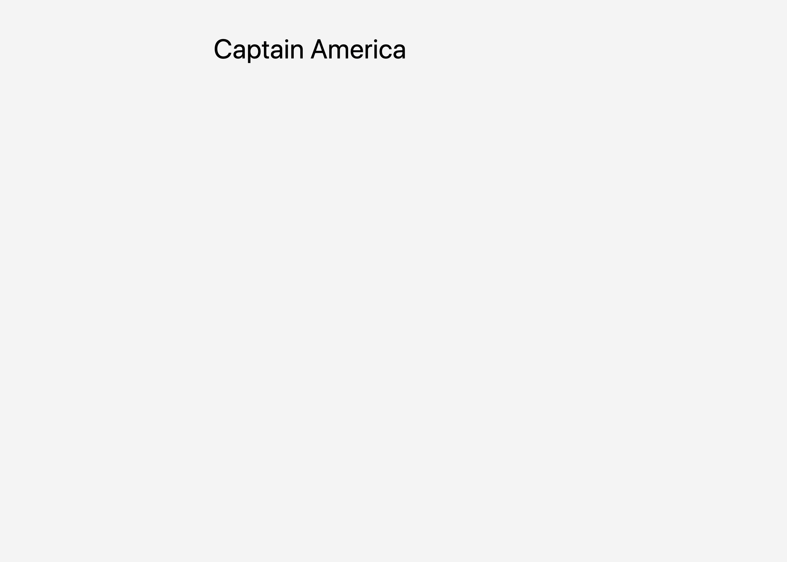

# Extending A Template

## Table of Contents

* [Before You Get Started](#before-you-get-started)
* [Folder Structure End State](#folder-structure-end-state)
* [Steps](#steps)
* [Verification](#verification)

## Before You Get Started

In this tutorial, you will create an HTML template that extends another template using `<% extends("index.html") %>` and `<% yield %>`.

## Folder Structure End State

Upon completing the Steps section below, your project's folder structure should look similar to the following:

```
▾ /path/to/your/project/
  ▾ /views
    index.html
    user.html
  app.ts
  user_resource.ts
```

## Steps

1. Create your top-level template file. `<% yield %>` will yield the contents of the template that extends this one. In this case, it is the contents of the template in the next step.

    Filename: `/path/to/your/project/views/index.html`

    ```html
    <!DOCTYPE html>
    <html class="h-full w-full">
      <head>
        <meta charset="utf-8"/>
        <meta name="viewport" content="width=device-width, minimum-scale=1.0, user-scalable=no"/>
        <link rel="stylesheet" href="https://cdn.jsdelivr.net/npm/tailwindcss/dist/tailwind.min.css">
        <title>Skills</title>
      </head>
      <body style="background: #f4f4f4">
        <% yield %>
      </body>
    </html>
    ```

2. Create your extended template. The contents of this file will replace the `<% yield %>` variable. The `index.html` file must be relative to the `views_path` config.

    Filename: `/path/to/your/project/views/user.html`
    
    ```html
    <% extends("/index.html") %>

    <div style="max-width: 640px; margin: 50px auto;">
      <h1 class="text-5xl"><% user.name %></h1>
    </div>
    ```

3. Create your resource file.

    Filename: `/path/to/your/project/user_resource.ts`
    
    ```typescript
    import { Drash } from "https://deno.land/x/drash@v1.3.0/mod.ts";

    export class UserResource extends Drash.Http.Resource {

      static paths = ["/user"];

      public GET() {
        this.response.body = this.response.render(
          "/user.html",
          {
            user: {
              name: "Captain America",
            },
          },
        );
        return this.response;
      }
    }
    ```

4. Create your app file.

    Filename: `/path/to/your/project/app.ts`
    
    ```typescript
    import { Drash } from "https://deno.land/x/drash@v1.3.0/mod.ts";
    import { Tengine } from "https://deno.land/x/drash_middleware@v0.6.1/tengine/mod.ts";
    import { UserResource } from "./user_resource.ts";

    // Configure Tengine
    const tengine = Tengine({
      render: (...args: unknown[]): boolean => {
        return false;
      },
      views_path: "./path/to/your/project/views" // DO NOT include a trailing slash
    });

    const server = new Drash.Http.Server({
      middleware: {
        after_resource: [
          tengine
        ]
      },
      resources: [
        UserResource
      ],
      response_output: "text/html",
    });

    server.run({
      hostname: "localhost",
      port: 1447
    });
    ```

## Verification

You can verify that your app's code works by making requests like the ones below. Since this tutorial's app sets `text/html` as the `response_output`, the server responds to requests with HTML by default.

1. Run your app.

    ```shell
    $ deno run --allow-net --allow-read app.ts
    ```
    
2. Go to `localhost:1447/user` in your browser. You should receive the following response:

    

---

Other tutorials: [Creating A Template](./creating_a_template.md) | [Adding Template Partials](./adding_template_partials) | [In-Template JavaScript](./in_template_javascript.md)
